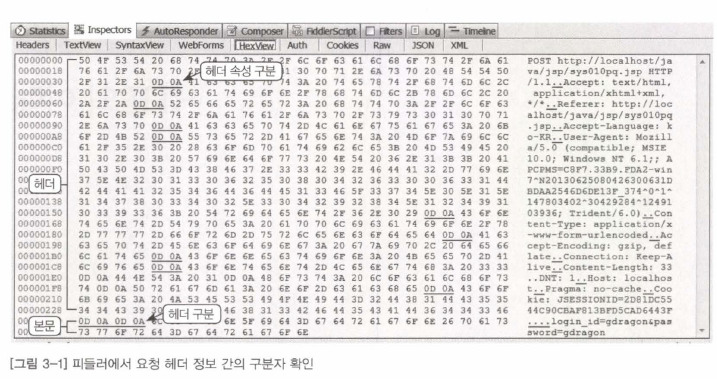

03부 화면 응답시간 분석
	
	1. 기본방향
		1.1 중점 분석 항목
			1.1.1 처리시간
			1.1.2 화면 컨텐츠 구성
			1.1.3 캐시 동작
			1.1.4 병렬/비동기 처리
			1.1.5 사용 환경
			
	2. HTTP의 이해
		2.1 프로토콜구조
			2.1.1 특징
				- 서버간 요청과 응답이 1:1, 즉, 화면 구성 컨텐츠가 100개라면 요청과 응답이 100번 이루어짐.
			
			2.1.2 헤더
				- 처리 대상, 결과 코드, 데이터 처리를 위한 각종 속성 정보 포함		
				- GET 방식의 경우 본문이 존재하지 않음.
				- 헤더 속성 간 구분자는 [CLRF]임. 16진수로는 [0D0A]
				
			2.1.3 본문
				- 헤더와 본문의 구분자는 [CLRFCLRF]임. 16진수로는 [0D0A0D0A]
			
			
				
		2.2 HTTP 요청
		2.3 HTTP 응답
		2.4 데이터 송수신
		
	3. 화면 응답시간 모니터링
		3.1 화면 응답시간 모니터링 도구
		3.2 인터넷 익스플로러 프로파일링
		3.3 피들러
		3.4 HTTP 분석 접근

	4. 웹 기반 시스템 성능 개선
		4.1 화면콘텐츠구성
			4.1.1 콘텐츠 수 축소
			4.1.2 크기별 이미지 준비
			4.1.3 이미지 콘텐츠 파일의 크기 축소
			4.1.4 CON 사용
			4.1.5 텍스트 콘텐츠의 크기 축소
			4.1.6 압축 적용
			4.1.7 웹 가속기

		4.2 캐시동작
			4.2.1 브라우저 캐시
	
		4.3 병렬/비동가 처리
			4.3.1 네트워크 연결 증가
			4.3.2 AJAX와 DOM을 이용한 비동기 처리
			
		4.4 기타 성능 개선
		
		4.5 웹 서버 설정
			4.5.1 최대 병렬 처리 수
			4.5.2 Keepalive
		
		
	5. 웹 서버 모니터링
		5.1 웹 요청 응답시간모니터링
		5.2 웹 서버 성능 모니터링
	
	6. HTTPS